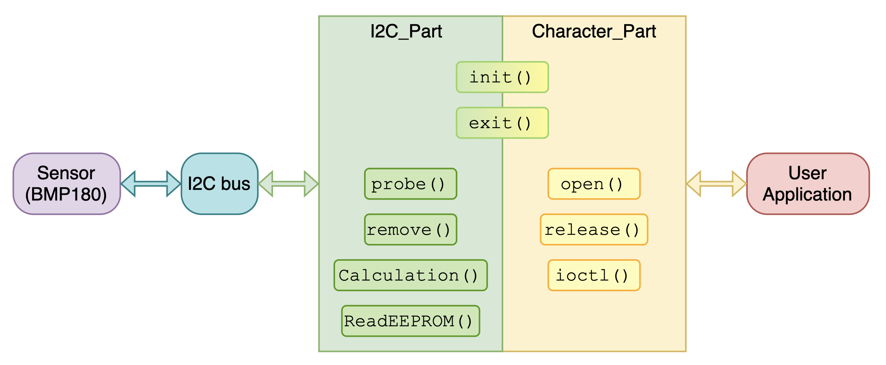

#Драйвер устройства I2C для взаимодействия с датчиком температуры и давления BMP180

---------------------------------------------------------

|Архитектура драйвера
------
|

---------------------------------------------------------

Реализован драйвер устройства I2C для взаимодействия с датчиком температуры и давления BMP180. Также реализовано пользовательское приложение для взаимодействия с драйвером. Вычисление температуры и давление происходит в режиме ядра с дальнейшей передачей в пространство пользователя. Вычисление высоты над уровнем моря происходит в пространстве пользователя, поскольку требует использования чисел с плавающей точкой. При этом пользователю при запросе высылаются “сырые” данные (величина давления).